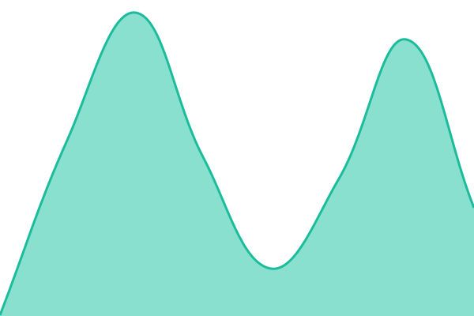
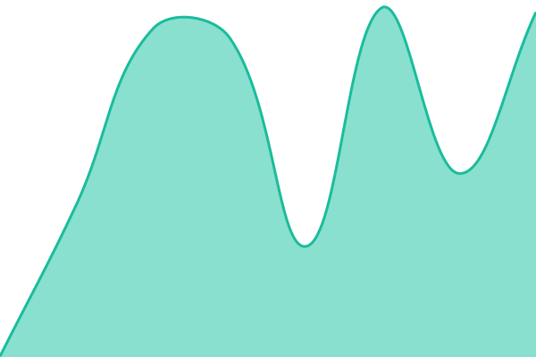
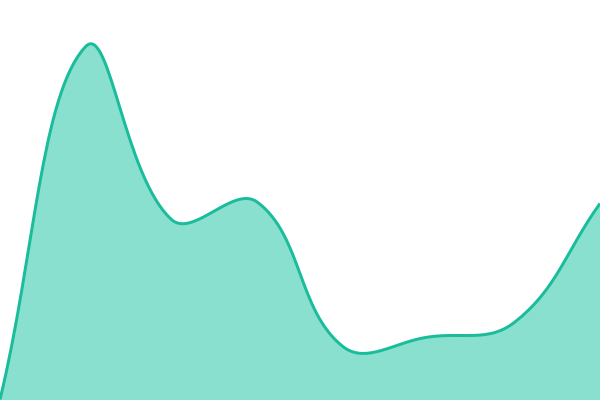

# [📈 Live Status](https://status.robosystems.ai): <!--live status--> **All systems operational**

This repository contains the open-source uptime monitor and status page for [RFS](https://robosystems.ai), powered by [Upptime](https://github.com/upptime/upptime).

With [Upptime](https://upptime.js.org), you can get your own unlimited and free uptime monitor and status page, powered entirely by a GitHub repository. We use [Issues](https://github.com/RoboFinSystems/status/issues) as incident reports, [Actions](https://github.com/RoboFinSystems/status/actions) as uptime monitors, and [Pages](https://status.robosystems.ai) for the status page.

<!--start: status pages-->
<!-- This summary is generated by Upptime (https://github.com/upptime/upptime) -->
<!-- Do not edit this manually, your changes will be overwritten -->
<!-- prettier-ignore -->
| URL | Status | History | Response Time | Uptime |
| --- | ------ | ------- | ------------- | ------ |
|  [RoboSystems API](https://api.robosystems.ai/v1/status) | 🟩 Up | [robosystems-api.yml](https://github.com/RoboFinSystems/status/commits/HEAD/history/robosystems-api.yml) | 

 245ms
     
 | 

<a href="https://status.robosystems.ai/history/robosystems-api">100.00%</a>
    

|  [RoboSystems](https://robosystems.ai) | 🟩 Up | [robosystems.yml](https://github.com/RoboFinSystems/status/commits/HEAD/history/robosystems.yml) | 

 241ms
     
 | 

<a href="https://status.robosystems.ai/history/robosystems">100.00%</a>
    

|  [RoboLedger](https://roboledger.ai) | 🟩 Up | [roboledger.yml](https://github.com/RoboFinSystems/status/commits/HEAD/history/roboledger.yml) | 

 267ms
     
 | 

<a href="https://status.robosystems.ai/history/roboledger">100.00%</a>
    

|  [RoboInvestor](https://roboinvestor.ai) | 🟩 Up | [roboinvestor.yml](https://github.com/RoboFinSystems/status/commits/HEAD/history/roboinvestor.yml) | 

 291ms
     
 | 

<a href="https://status.robosystems.ai/history/roboinvestor">100.00%</a>
    

<!--end: status pages-->

[**Visit our status website →**](https://status.robosystems.ai)

## 📄 License

- Powered by: [Upptime](https://github.com/upptime/upptime)
- Code: [MIT](./LICENSE) © [Anand Chowdhary](https://anandchowdhary.com)
- Data in the `./history` directory: [Open Database License](https://opendatacommons.org/licenses/odbl/1-0/)
